<h1 align="center"> Parking Spot Security  </h1>

Utilizing Spring Security in a previous application  

  <a href="#-tecnologies">Tecnologies</a>&nbsp;&nbsp;&nbsp;|&nbsp;&nbsp;&nbsp;
  <a href="#-project">Project</a>&nbsp;&nbsp;&nbsp;|&nbsp;&nbsp;&nbsp;
  <a href="#memo-license">License</a>

 

## 🚀 Tecnologies

This project was developed with the following technologies:

- Java
- Spring framework 🍃 - Spring Security, Spring Data JPA, Spring Validation & Spring Web
- Postgres 🐘
- Git & Github 
- Postman

## 💻 Project

The Parking Spot is an application responsible for implementing a CRUD along with validations to simulate a registration in a parking space. In this extension. we use Spring Security to authorize users (by role) to use certain endpoints 

## :memo: License

This project is under license from MIT

 

## Database 
  - User table contains a password encoded and a UUID (i use the UUID generator):

  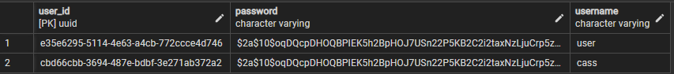

- Here is the password in code and the password encoded in terminal:

  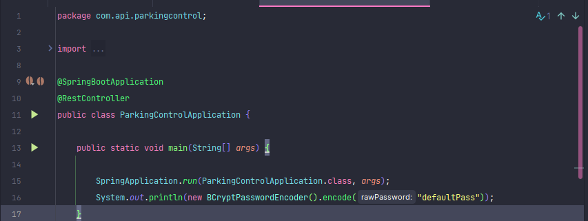
  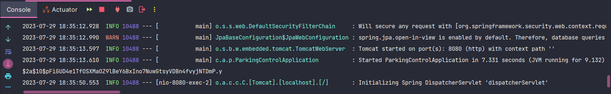

- Roles table contains only 2 roles to determine access to certain endpoints in application (i used the UUID generator again for the role_id field) :

  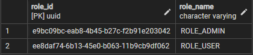

- Table users_roles is responsible for matching the user to their role, allowing exclusive access to certain methods:

  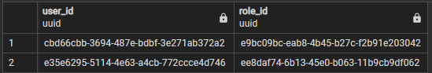

- Here is the config of endpoints:

  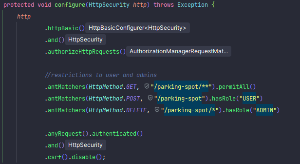

 

## Endpoints 📡

 

### GET 
  - All info about the registered spots:
  - This endpoint is allowed to all roles in db

  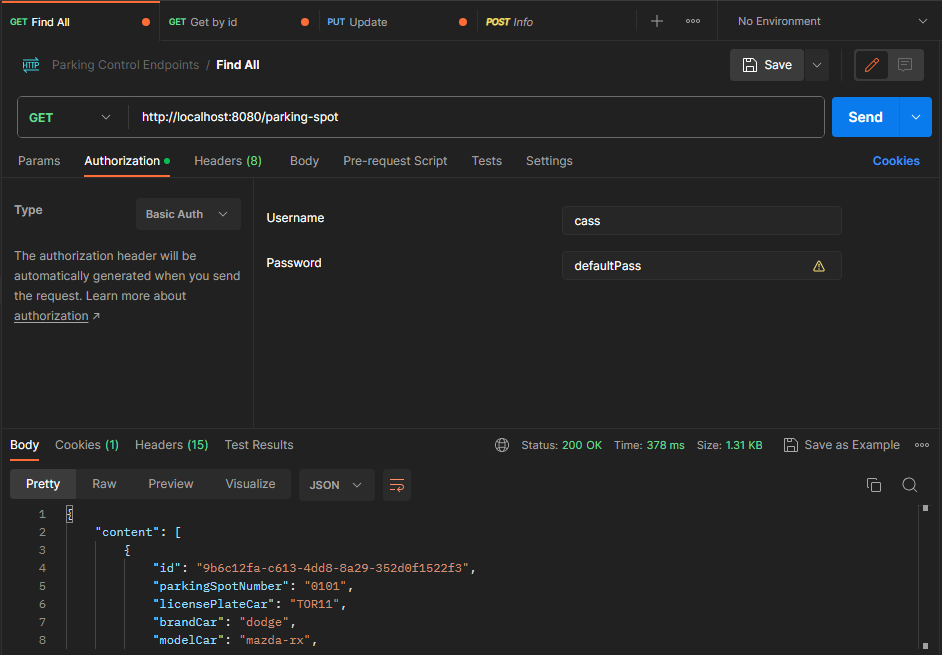

  - Using the wrong password the access is denied

  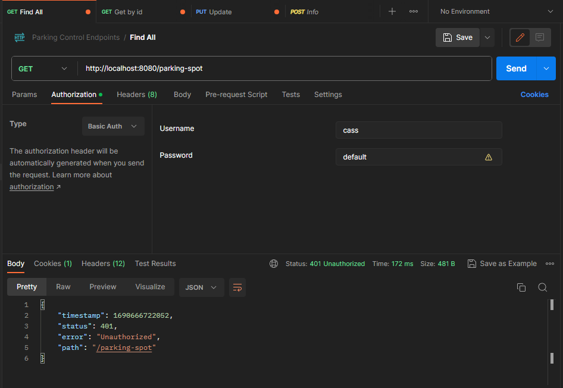

 

### POST 
  - Register a spot:
  - This method is only allowed for the role USER 

  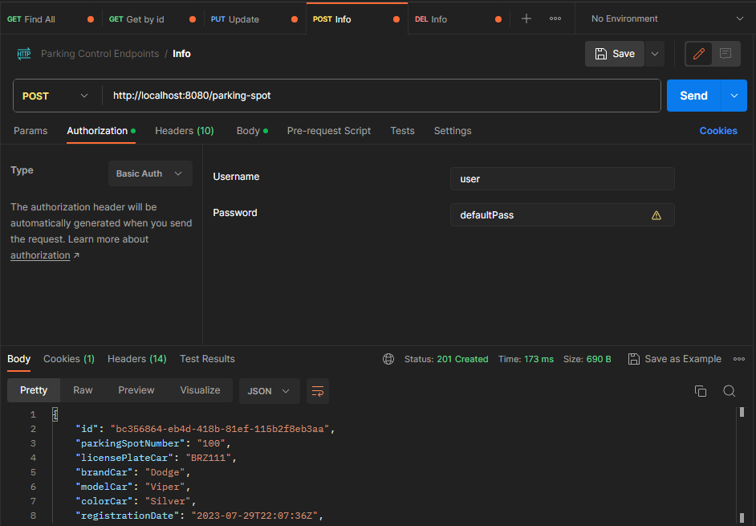

  - If the ADMIN tries to access the method... 

  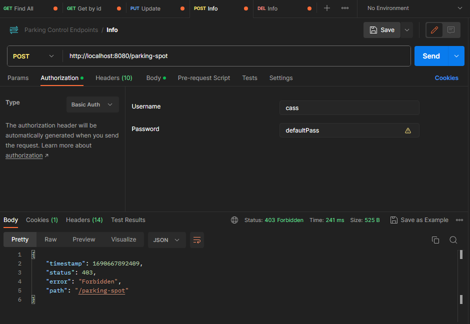

 

### Update ⚙ (PUT):
  - Updating by id:
  - Only allowed to ADMIN role

  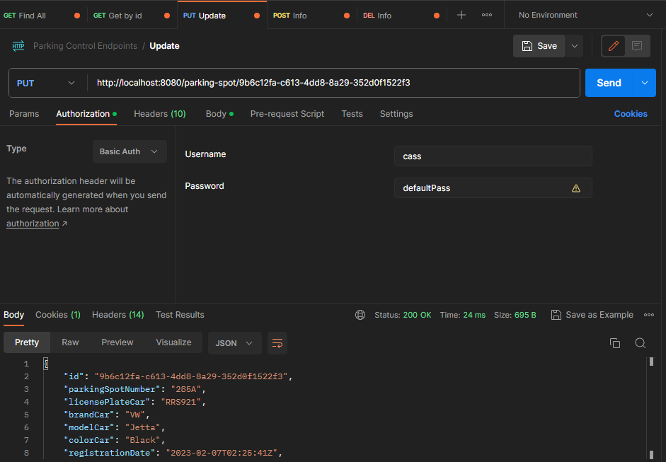

  - If the USER tries to access the method... 

  

 

### Delete ❌:
  - Deleting by id:
  - Only allowed to ADMIN role

  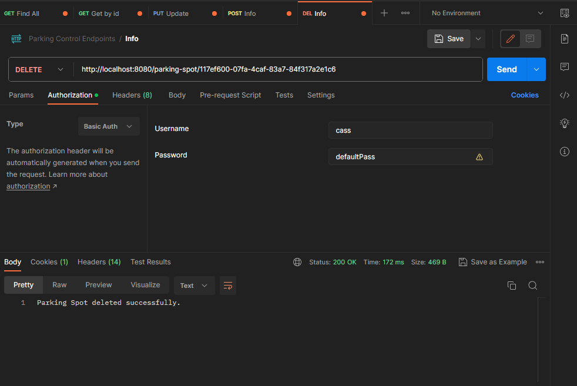

 - If the USER tries to access the method... 

  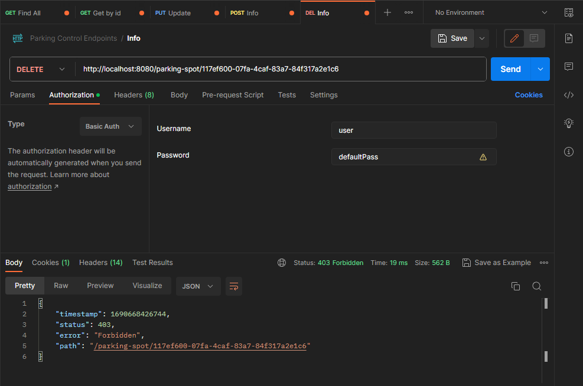

  

### Thanks for your attention, see you next time 💜

